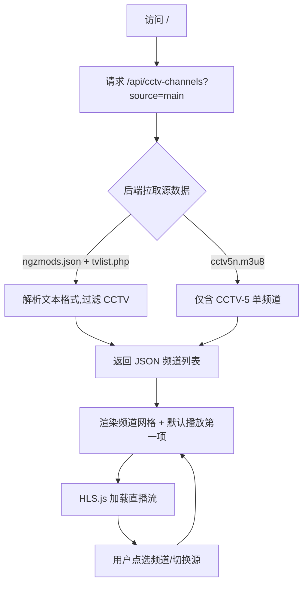

# BawTV · PRD（产品需求文档）

## 1. 产品概述

BawTV 是一个极简的 CCTV 直播 Web 播放器，专注于将分散的电视直播源整合到一个干净的网页界面中，让用户点开即看。
- 主要目的：免安装、零干扰地观看 CCTV 全部频道直播，覆盖央视综合、新闻、综艺、体育、纪录、电视剧等 30+ 频道
- 解决问题：当前电视直播源散落在多个第三方接口（TVBox 配置、单流 m3u8）中，用户在桌面端缺乏一个稳定、轻量、跨浏览器的统一入口
- 目标用户：希望在 Mac/PC 浏览器上随手开 CCTV 直播的用户（追新闻、赛事、家中副屏播放）

## 2. 核心功能

### 2.1 用户角色

本产品无需注册与登录，无角色区分；所有用户对所有功能拥有同等权限。

### 2.2 功能模块

1. **首页（直播播放页）**：视频播放器、频道列表网格、源切换、当前播放信息
2. **频道详情（内嵌于首页）**：选中频道后，播放器切换到该频道的直播流

### 2.3 页面与功能详情

| 页面名称 | 模块名称 | 功能描述 |
|----------|----------|----------|
| 首页 | 顶部品牌区 | 展示 BawTV 标识、当前播放频道名；右侧提供源切换控件（MAIN / BACKUP） |
| 首页 | 视频播放器 | HLS 直播播放器，支持全屏、播放/暂停、静音、音量调节、错误重试；自动跟随选中频道切换流地址 |
| 首页 | 频道列表网格 | 仅展示 CCTV 频道（CCTV-1HD ~ CCTV-17HD、CCTV-5+、CCTV-4K、CCTV-8K 等），点击即切换；当前播放高亮 |
| 首页 | 源切换 | 顶部分段控件（MAIN · 速度较快 / BACKUP · 兜底源），切换后频道列表与播放器自动重新加载 |
| 首页 | 错误与重试 | 拉取频道列表失败时显示"加载失败，点此重试"；播放器断流时显示"直播中断，尝试切换源" |

## 3. 核心流程

1. 用户访问 `/` → 页面加载
2. 客户端请求后端 `/api/cctv-channels?source=main|backup` → 后端拉取对应源 → 解析/过滤 CCTV 频道 → 返回 JSON
3. 频道列表渲染为网格，默认选中第一个频道（CCTV-1HD）
4. 播放器加载第一个频道的播放地址
5. 用户点击频道 → 播放器切换流
6. 用户点击 MAIN/BACKUP → 重新拉取频道列表 → 自动选中第一个 → 播放器加载

## 4. 用户界面设计

### 4.1 设计风格

- **主色**：纯黑背景（`#000`），与视频播放场景统一，避免光晕
- **次色**：玻璃质感（`rgba(255,255,255,0.06)` + 40px backdrop-blur）作为控件底色
- **强调色**：直播红 `#ff2d2d`（仅在"直播中"角标、当前播放高亮处使用）
- **按钮风格**：圆角胶囊（999px）+ 玻璃质感；主操作使用白色实底 + 黑字
- **字体**：系统字体栈 `-apple-system, BlinkMacSystemFont, "SF Pro Display", "Helvetica Neue", sans-serif`；频道名 13–15px、半粗体
- **布局风格**：左视频 / 右频道列表（桌面端 ≥1024px），移动端堆叠为上下结构
- **图标**：极简线性图标（自绘 SVG 即可），禁用 emoji

### 4.2 页面设计概览

| 页面名称 | 模块名称 | UI 元素 |
|----------|----------|----------|
| 首页 | 顶部品牌区 | 左侧 "BawTV" 文字 logo + 副标题 "CCTV 直播"；右侧 MAIN/BACKUP 圆角分段控件（白色高亮当前态，背景 0.05 透明度，hover 0.1） |
| 首页 | 视频播放器 | 16:9 黑色画布，顶部叠加"直播中"红点 + 频道名；底部原生 video 控件；点击全屏按钮后占满屏幕 |
| 首页 | 频道列表 | 网格 2 列（移动端 2 列 / 桌面端 3-4 列），每项为玻璃卡片：频道名 + 角标（HD/4K/8K）；当前播放频道用红色左边框 + 白色高亮文字 |
| 首页 | 错误态 | 居中显示加载失败图标 + 文字 + "重试"按钮（圆角胶囊） |

### 4.3 响应式设计

- **桌面优先**：≥1024px 时左右分栏（视频 65% / 频道列表 35%）
- **平板**：768~1023px 时左右分栏比例调整为 60% / 40%
- **移动端**：<768px 时视频在上、频道列表在下（高度 60vh / 40vh），频道网格 2 列
- **触屏优化**：频道卡片最小点击区 44×44px；播放器控件使用原生 video 控件以保证触屏体验

### 4.4 不适用 3D 场景

本项目为传统视频播放应用，无需 3D 场景。
