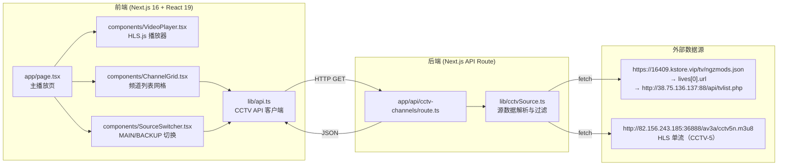
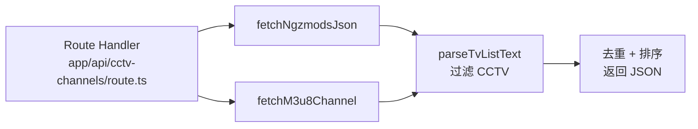
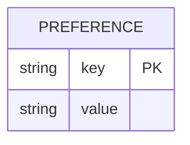

# BawTV · Technical-Architecture（技术架构文档）

## 1. 架构设计



## 2. 技术栈

- **前端框架**：Next.js 16.2.4（App Router）+ React 19.2.4 + TypeScript 5
- **初始化工具**：在空目录内手写 `package.json` + `tsconfig.json` + `next.config.ts`（沿用 BawMusic 同款配置，不引入 Vite，避免与 Next.js 混用）
- **样式方案**：原生 CSS + CSS Variables（与 BawMusic 一致，玻璃质感、纯黑背景）
- **视频播放**：HLS.js（跨浏览器 HLS；Safari/iOS 用原生 `video[src]`）
- **后端**：Next.js Route Handlers（`app/api/cctv-channels/route.ts`）
- **数据库**：无（数据全部来自外部源，运行时 fetch）
- **数据缓存**：Next.js `fetch` 默认 no-store，每次请求源站，避免 CORS/缓存陈旧
- **静态导出**：`output: 'export'` 关闭（如需纯静态导出则保留，由后续决定）

## 3. 路由定义

| 路由 | 用途 |
|------|------|
| `/` | 主播放页：视频播放器 + 频道列表 + 源切换 |
| `/api/cctv-channels` | GET 接口，Query 参数 `source=main\|backup`，返回该源下的 CCTV 频道列表 JSON |

## 4. API 定义

### GET `/api/cctv-channels?source={main|backup}`

**请求**：
- Query：`source` 必填，取值 `main` 或 `backup`

**响应 200**：
```ts
type Channel = {
  id: string;            // 稳定 ID（频道名 slug）
  name: string;          // 原始频道名（例：CCTV-1HD）
  url: string;           // 直播流地址（m3u8 / m3u 等）
  badge?: 'HD' | '4K' | '8K' | '+';
};

type CctvChannelResponse = {
  source: 'main' | 'backup';
  fetchedAt: string;     // ISO 时间
  channels: Channel[];
};
```

**响应 5xx**：
```ts
type ErrorResponse = {
  error: string;
  message: string;
};
```

## 5. 服务端架构

Next.js Route Handler 直接调用 `lib/cctvSource.ts` 中的纯函数（无中间层），单文件扁平结构。



### 5.1 数据源 1（MAIN）解析逻辑

1. GET `https://16409.kstore.vip/tv/ngzmods.json` → JSON
2. 取 `lives[0].url`（`http://38.75.136.137:88/api/tvlist.php`） → 文本
3. 按行解析：
   - 形如 `分类名,#genre#` → 分类头
   - 形如 `频道名,http://...` → 频道行
4. 仅保留频道名以 `CCTV` 开头的行
5. 提取 HD/4K/8K/+ 角标

### 5.2 数据源 2（BACKUP）解析逻辑

1. GET `http://82.156.243.185:36888/av3a/cctv5n.m3u8` → m3u8 文本
2. 校验 `#EXTM3U` 头，提取流地址
3. 构造单条频道：`CCTV-5+HD`，URL 为该 m3u8 地址

## 6. 数据模型

### 6.1 数据模型定义

本项目为无数据库应用，运行时无持久化数据；前端仅在 `localStorage` 存储用户偏好的源（key: `bawtv.apiSource`），用于刷新后恢复。



### 6.2 DDL（仅说明）

无数据库表结构。若未来引入收藏功能，可新增：

```sql
CREATE TABLE favorites (
  id          TEXT PRIMARY KEY,
  channel_id  TEXT NOT NULL,
  created_at  TIMESTAMP DEFAULT CURRENT_TIMESTAMP
);
```

## 7. 关键依赖

| 依赖 | 版本 | 用途 |
|------|------|------|
| `next` | 16.2.4 | React 框架 |
| `react` / `react-dom` | 19.2.4 | UI 库 |
| `typescript` | ^5 | 类型系统 |
| `hls.js` | ^1.5.x | 跨浏览器 HLS 播放 |

## 8. 部署与运行

- 开发：`npm run dev`
- 构建：`npm run build`
- 类型检查：`npm run typecheck`
- 静态导出（可选）：`output: 'export'` + `next build` → `out/`

## 9. 后续可扩展（不在本次范围）

- 频道搜索与分类筛选
- 收藏与最近播放
- 画中画（PiP）
- 多源自动降级（源内首屏失败时自动切到 BACKUP）
- EPG（节目单）展示
